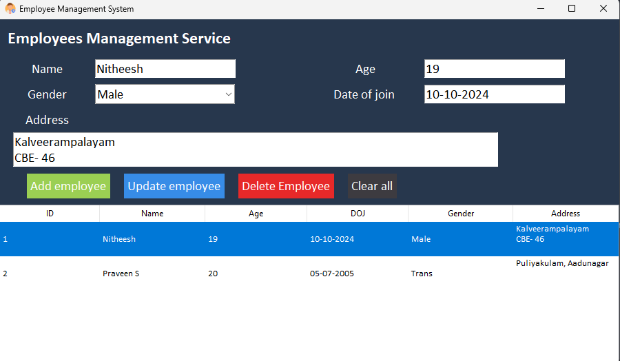

# Employee Management System

## Project Overview

This project is a **GUI-based Employee Management System** developed using Python and SQLite, along with Tkinter for the front-end interface. The system allows users to manage employee records by adding, updating, deleting, and viewing employee data.



### Tech Stack:

- **Python**: Core programming language
- **SQLite**: Database for storing employee records
- **Tkinter**: GUI framework for the interface
- **Vercel**: Icon for the application

## Features

1. **Add Employee**: Add new employee records into the database.
2. **Update Employee**: Modify existing employee details.
3. **Delete Employee**: Remove employee records.
4. **Display All Employees**: View all employee details.
5. **Clear Form**: Clear all input fields.

## Database Schema

```sql
CREATE TABLE IF NOT EXISTS employee (
    id Integer PRIMARY KEY,
    name text,
    age text,
    doj text,
    gender text,
    address text
);
```

## Functions

### `insert(name, age, doj, gender, address)`

Inserts a new employee record into the `employee` table.

### `remove(id)`

Deletes an employee record by their `id`.

### `update(id, name, age, doj, gender, address)`

Updates an employee's details based on the given `id`.

### `fetch()`

Fetches all employee records from the database.

### `main()`

Creates the `employee` table if it doesn't exist and inserts a sample record for testing.

## Tkinter GUI Components

### Input Fields:

- **Name**: `Entry`
- **Age**: `Entry`
- **Gender**: `Combobox` (Values: 'Male', 'Female', 'Trans', 'Others')
- **Date of Joining**: `Entry`
- **Address**: `Text`

### Buttons:

- **Add Employee**: Calls the `add_emp()` function to insert a new employee.
- **Update Employee**: Calls the `update_emp()` function to modify an employee record.
- **Delete Employee**: Calls the `delete_emp()` function to remove an employee record.
- **Clear All**: Clears all input fields in the form.

### Treeview:

Displays employee details like `ID`, `Name`, `Age`, `DOJ`, `Gender`, and `Address`.

## Usage Instructions

1. **Add Employee**: Fill in all the fields and click **Add Employee**.
2. **Update Employee**: Select an employee from the list, update the fields, and click **Update Employee**.
3. **Delete Employee**: Select an employee from the list and click **Delete Employee**.
4. **Clear All**: Click **Clear All** to reset the form fields.

## Error Handling

- Displays error messages for missing or invalid inputs using Tkinter's `messagebox.showerror`.
